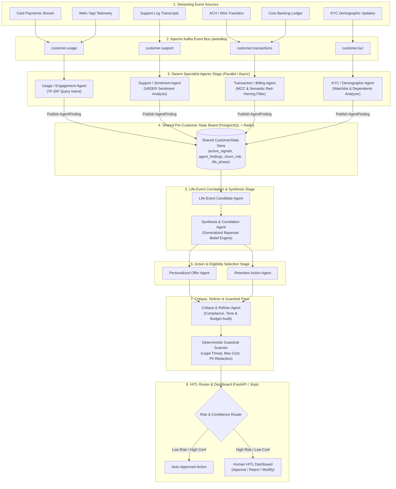

# End-Term System Architecture Specification (`ACT-TREE 360`)
**Framework**: Actor-Critic Blackboard Swarm with Dynamic Life-Phase Hypothesis Trees  
**Track**: Natural Language Processing (NLP) — Inter IIT Tech Meet 15.0 Prepathon  
**Author**: Om Mishra | Electronics Engineering (3rd Year), IIT (BHU) Varanasi | Roll No.: 24095073  

---

## 1. High-Level Architecture Overview

The **`ACT-TREE 360`** production architecture transforms raw, asynchronous, multi-modal streaming data into real-time customer state inferences and targeted, safe enterprise interventions. The system operates on an **Ambient, Event-Driven Multi-Agent System (MAS)** model powered by **LangGraph**, **Apache Kafka Event Bus**, **PostgreSQL + pgvector**, **Redis Working Memory**, and **FastAPI**.

### Production Architecture Diagram



---

## 2. 3-Tiered Memory Architecture

To achieve production-grade state persistence and eliminate context window pollution, `ACT-TREE 360` enforces a strict 3-tier memory topology:

| Tier | Infrastructure | Scope & Content | Access Pattern |
|---|---|---|---|
| **Tier 1: Working Memory** | **Redis** | Active session state, current ticket transcripts, temporary agent assertions | Sub-millisecond `getex`/`setex` lookup with 1-hour TTL |
| **Tier 2: Episodic Memory** | **PostgreSQL** | Chronological log of past customer interventions, offers, and customer responses | Decay-weighted RAG ($Score = \alpha \cdot \text{Recency} + \beta \cdot \text{Importance} + \gamma \cdot \text{Relevance}$) |
| **Tier 3: Semantic Memory** | **pgvector** | Live policy vector index (hardship terms, fee waivers, legal compliance rules) | Semantic cosine vector retrieval over pgvector embeddings |

---

## 3. Database Schema Design (PostgreSQL + pgvector)

```sql
-- Customers Profile Table
CREATE TABLE customers (
    customer_id VARCHAR(64) PRIMARY KEY,
    first_name VARCHAR(64),
    last_name VARCHAR(64),
    segment VARCHAR(32),
    created_at TIMESTAMP DEFAULT CURRENT_TIMESTAMP
);

-- Agent Findings / State Board Assertions Table
CREATE TABLE agent_findings (
    finding_id VARCHAR(64) PRIMARY KEY,
    customer_id VARCHAR(64) REFERENCES customers(customer_id),
    agent_name VARCHAR(64),
    finding_type VARCHAR(64),
    finding_value JSONB,
    confidence FLOAT,
    timestamp TIMESTAMP,
    expires_at TIMESTAMP
);

-- Customer State Table (Shared State Board Snapshot)
CREATE TABLE customer_state (
    customer_id VARCHAR(64) PRIMARY KEY REFERENCES customers(customer_id),
    current_life_phase VARCHAR(64),
    life_phase_confidence FLOAT,
    churn_risk FLOAT,
    churn_confidence VARCHAR(16),
    active_signals JSONB,
    agent_findings JSONB,
    last_updated TIMESTAMP
);

-- Interventions Table
CREATE TABLE interventions (
    intervention_id VARCHAR(64) PRIMARY KEY,
    customer_id VARCHAR(64) REFERENCES customers(customer_id),
    action_type VARCHAR(64),
    action_subtype VARCHAR(64),
    reason TEXT,
    estimated_cost FLOAT,
    hitl_status VARCHAR(32),
    created_at TIMESTAMP DEFAULT CURRENT_TIMESTAMP
);

-- OpenTelemetry Audit Log Table
CREATE TABLE audit_logs (
    trace_id VARCHAR(64) PRIMARY KEY,
    timestamp TIMESTAMP,
    customer_id VARCHAR(64),
    agent VARCHAR(64),
    event VARCHAR(64),
    input_reference JSONB,
    output JSONB
);
```

---

## 4. Multi-Agent System Topologies & LangGraph Coordination

The system composes distinct coordination topologies mapped to specific pipeline stages:

1. **Parallel Swarm Stage**: Domain specialist agents (`UsageAgent`, `SupportAgent`, `TxnAgent`, `KYCAgent`) ingest stream windows asynchronously, executing real NLP models (VADER sentiment analysis, TF-IDF semantic vector intent classification, entity extraction) and writing structured assertions to `SharedStateBoard`.
2. **Sequential Correlation Stage**: `LifeEventAgent` and `SynthesisAgent` execute a **Generalized Bayesian Belief Accumulator** to evaluate candidate customer states ($P(\text{medical\_hardship})$, $P(\text{new\_child})$, $P(\text{churn\_risk})$) without scenario-specific hardcoding.
3. **Actor-Critic Counterfactual Audit Stage**: `DebateAgent` audits candidate state inferences against counterfactual red-herring vector rules (isolating tuition wires, resort refunds, and tax deposits).
4. **Round-Robin Action & Refiner Stage**: `ActionAgent` drafts intervention proposals from semantic product eligibility matrices, audited by `CritiqueRefinerAgent` for tone, budget limits, and guardrails.
5. **Deterministic Guardrails Stage**: Non-LLM fast-path scanner inspects text for legal threats (`"lawsuit"`, `"attorney"`) and redacts PII at the data layer.
6. **HITL Routing & Dashboard**: FastAPI web dashboard surfaces customer timeline, cited evidence graph, and `APPROVE / REJECT / MODIFY` controls.
