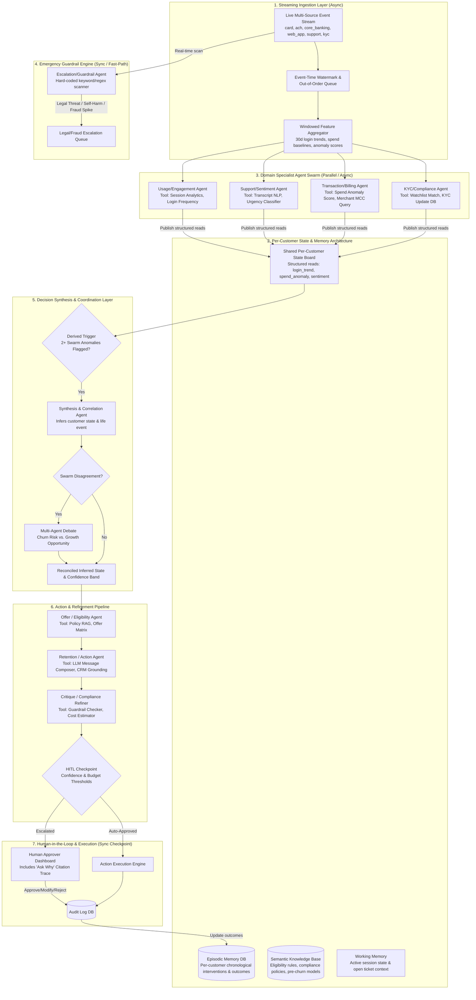

# Preliminary System Architecture Specification
**Project**: Agentic Customer 360 — Proactive Intervention Desk  
**Event**: Inter IIT Tech Meet 15.0 Prepathon (NLP Track)  
**Submission Date**: September 15, 2026 (Mid-Term Deliverable)  

---

## 1. High-Level Architecture Overview

The system architecture transforms raw, asynchronous, multi-modal streaming data into real-time customer state inferences and targeted, safe enterprise interventions. The system operates on an **Ambient, Event-Driven Multi-Agent System (MAS)** model backed by a **Shared Per-Customer State Board** and a **3-Tier Memory Architecture**.

### Architecture Diagram



---

## 2. Component Specifications & Agent Rosters

### 2.1 Domain Specialist Swarm Agents (Parallel Execution)

| Agent Name | Monitored Data / Signals | Toolset & Data Source Access | Trigger Type | Output Written to State Board |
|---|---|---|---|---|
| **Usage / Engagement Agent** | App/web login frequency, feature drop-off, session length trends | `query_telemetry_db`, `compute_rolling_login_avg` | Event-based (login event) + Time-based (daily rollup) | `login_frequency_trend` (-40%), `app_engagement_score` |
| **Support / Sentiment Agent** | Support tickets, chat transcripts, call summaries | `sentiment_classifier`, `urgency_scanner`, `ticket_history_db` | Event-based (new ticket/message) | `sentiment_score` (-0.82), `unresolved_complaint_flag` |
| **Transaction / Billing Agent** | Payments, ACH/wire transfers, credit card spending, merchant MCCs | `txn_anomaly_scorer`, `historical_baseline_query` | Event-based (transaction stream) | `spend_anomaly_score`, `large_outbound_transfer_flag` |
| **KYC / Compliance Agent** | Address changes, marital status, dependents update, sanctions matches | `kyc_database_query`, `watchlist_lookup` | Event-based (KYC update) + Time-based (quarterly) | `dependents_change_flag`, `kyc_status` |

---

### 2.2 Core Synthesis & Action Agents

| Agent Name | Responsibilities | Toolset & Inputs | Trigger Type | Output Package |
|---|---|---|---|---|
| **Synthesis / Correlation Agent** | Reconciles swarm signals from State Board; infers customer life event & state | State Board reader, Episodic RAG retriever | Agent-dependent (fires when 2+ swarm signals trigger) | `inferred_state`, `confidence_band` (`low`/`medium`/`high`) |
| **Offer / Eligibility Agent** | Verifies eligibility for loans, credit limits, fee waivers, payment plans | `policy_rag_query`, `eligibility_calculator` | Agent-dependent (fires post-Synthesis) | `eligible_action_subtypes`, `max_value_cap` |
| **Retention / Action Agent** | Decides specific intervention & drafts outreach message or escalation brief | `llm_message_composer`, `crm_record_grounding` | Agent-dependent (fires post-Offer) | Drafted action proposal (`action`, `action_subtype`) |
| **Critique / Compliance Refiner** | Audits proposal for tone, compliance, cost feasibility, and policy adherence | `policy_guardrail_checker`, `cost_estimator` | Agent-dependent (fires post-Action Agent draft) | Reviewed & refined action proposal or rejection back-step |

---

### 2.3 Non-Negotiable Safety & Guardrail Agents

| Agent Name | Responsibilities | Implementation Mechanism | Trigger Type | Action |
|---|---|---|---|---|
| **Escalation / Guardrail Agent** | Hard-stop condition scanner (legal threats, legal terms, AML spikes) | Deterministic regex/keyword scanner & strict rule bypass | Event-based (instant stream bypass) | Halts pipeline, sets `action = compliance_fraud_hold`, routes to legal |

---

## 3. Memory Architecture Details

### 3.1 Tier 1: Working Memory (Short-Term Session State)
- **Scope**: Ephemeral, single-customer active session context (e.g., active support ticket text, recent 3 logins).
- **Lifecycle**: Discarded or compressed once the current event sequence resolves.

### 3.2 Tier 2: Episodic Memory (Long-Term Per-Customer Log)
- **Scope**: Running history of past interventions, flags, and outcomes for this specific customer.
- **Storage**: Vector index + relational metadata table (`customer_id`, `timestamp`, `event_summary`, `intervention_taken`, `customer_response`).
- **Retrieval**: Weighted decay formula: $Score = \alpha \cdot \text{Recency} + \beta \cdot \text{Importance} + \gamma \cdot \text{Relevance}$.
- **Decay Policy**: Events older than 12 months are aggregated into a static profile summary unless explicitly flagged as a major life event baseline.

### 3.3 Tier 3: Semantic Memory (Cross-Customer & Policy Knowledge Base)
- **Scope**: Product rules, eligibility limits, pre-churn behavioral archetypes, regulatory guidelines.
- **Access**: Read-only for all agents via Policy RAG.

### 3.4 Shared Per-Customer State Board
- **Pattern**: Structured key-value blackboard scoped strictly to `customer_id`.
- **Purpose**: Prevents context pollution. Swarm agents write *structured findings* (e.g., `login_trend: -40%`), NOT raw chain-of-thought traces. Downstream Synthesis Agent reads all published key-values to build state.

---

## 4. Multi-Agent Coordination Topologies

1. **Swarm Stage (Parallel)**:
   - Usage, Support, Transaction, and KYC agents operate in parallel over incoming event streams, writing structured anomalies to the State Board without waiting for each other.
2. **Handoff Stage (Sequential Pipeline)**:
   - State Board -> Synthesis Agent -> Offer Agent -> Action Agent -> Refiner Agent -> HITL. Context passed between stages is strictly scoped JSON schemas.
3. **Agent Debate (Conflict Resolution)**:
   - Triggered when Swarm agents yield conflicting classifications (e.g., Transaction Agent flags a large deposit as `wealth_growth` while Support Agent flags a fee dispute as `churn_risk`).
   - Debate protocol: Agent A presents evidence -> Agent B rebuts -> Synthesis Agent adjudicates state and sets confidence.
4. **Round-Robin & Critique-Refiner (Drafting & Quality Pass)**:
   - Action Agent drafts personalized message -> Policy RAG checks rules -> Refiner passes tone/compliance check -> Output sent to HITL.

---

## 5. Non-Negotiable System Features

### 5.1 Explainability as a First-Class Output
Every action decision emitted by the system includes a structured `explanation` object:
```json
{
  "cited_signal_events": ["EVT_000392", "EVT_000406", "EVT_000444"],
  "retrieved_episodic_context": "Customer had ER visit on Feb 2 followed by disability income reduction on Feb 24.",
  "policy_rule_cited": "POL_MED_HARDSHIP_04: High-value customer with medical income disruption eligible for 6-month payment plan.",
  "reasoning_summary": "Sustained medical spending combined with reduced disability income and explicit support ticket justifies medical hardship payment plan."
}
```

### 5.2 Traceability & Audit Trail
Every agent execution emits an OpenTelemetry-compatible span:
- `trace_id`: Unique identifier per customer evaluation session.
- `span_id`, `agent_name`, `input_state_board_snapshot`, `prompt_template_version`, `tool_calls`, `output_json`.

### 5.3 Deterministic Guardrails & PII Security
- **Hard-Stop Conditions**: Keywords (`"lawsuit"`, `"attorney"`, `"legal action"`) trigger an immediate pipeline halt and route to legal.
- **PII Redaction**: Data-layer masking strips SSNs, full credit card numbers, and raw phone numbers before generating LLM prompt contexts.
- **Safe Blast Radii**: Autonomous agents can only *draft* proposals; execute/send actions require HITL approval or auto-approval within predefined low-risk policy thresholds.

---

## 6. Evaluation Schema Compliance

The output generated by the system at each checkpoint strictly adheres to the PS evaluation contract specified in `README_dataset_schema.md`:

```json
[
  {
    "as_of_time": "2026-03-26T00:00:00Z",
    "inferred_state": "medical_hardship",
    "confidence_band": "high",
    "action": "support_intervention",
    "action_subtype": "medical_hardship_payment_plan",
    "hitl_status": "escalated",
    "notes": "Medical bills and short-term disability income confirmed. Routed to HITL for support payment plan approval."
  }
]
```
